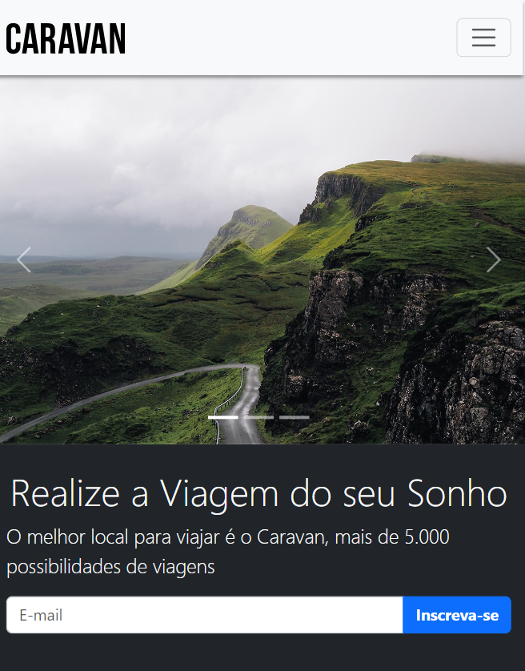

# Caravan Viagens - Projeto para aprendizado de BootStrap

A construção do site de viagens com uma página simples foi realizado como treinamento e aprendizado
na utilização de classes do BootStrap. O arquivo CSS e JS foram retirados do link por CDN.

## Table of contents

- [Overview](#overview)
  - [Screenshot](#screenshot)
  - [Links](#links)
- [My process](#my-process)
  - [Built with](#built-with)
  - [What I learned](#what-i-learned)
  - [Continued development](#continued-development)
  - [Useful resources](#useful-resources)
- [Author](#author)
- [Acknowledgments](#acknowledgments)

## Overview

### Screenshot

### Links

- Live Site URL: [Add live site URL here](https://kelf1729.github.io/Caravan_pj/)

## My process

### Built with

- Semantic HTML5 markup
- CSS custom properties
- Flexbox
- CSS Grid
- JavaScript
- Mobile
- Bootstrap 5

### What I learned

Aprendi a aplicar diversas classes entre elas:

- Criação de menu de navegação
- Menu dropdown
- Carousel de Imagens
- Form de emails
- Modal com login de página
- Grid e responsividade de colunas
- Citações e ajuste de texto
- Construção do Footer

### Continued development

Continuar aprimorando o uso de classes e combinações além de criar outras páginas de interface para o projeto
Caravan, onde não terá apenas as páginas de home.

## Author

- Website - [@kelf1729]
